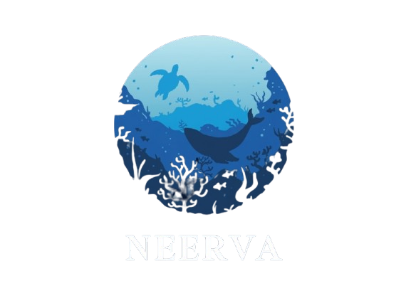

# 🌊 NEERVA — Marine Intelligence & Governance Platform

**NEERVA** is a cutting-edge, full-stack intelligence system designed for the Indian Ocean. It integrates real-time ocean monitoring, Machine Learning for fishery density prediction, and Agentic AI for species identification to support sustainable ocean management (SDG 14).

## 🚀 Core Features
- **Tactical Ocean Map**: Real-time heatmap of thermal fronts and fish density.
- **Agentic Species ID**: LangGraph-powered vision agent for marine species identification.
- **eDNA Analysis**: Genomic sequence classification using Random Forest ML models.
- **Coast Guard Command**: Centralized SOS management and vessel tracking.
- **Fisherman Dashboard**: Catch analytics and safety protocols.

## 🛠️ Technology Stack
- **Frontend**: React, Vite, GSAP (Cinematic Animations), Lucide Icons.
- **Backend**: Node.js, Express, Socket.io (Real-time), JWT (Role-Based Auth).
- **ML Service**: FastAPI, Scikit-Learn, Joblib.
- **AI Layers**: Google Gemini (Vision), Cohere (Genomics), Mistral (Chat).

## 🌍 Deployment
- **Frontend**: [Vercel](https://vercel.com)
- **Backend/ML**: [Render](https://render.com)
- **Database**: [MongoDB Atlas](https://mongodb.com/atlas)

## 🛠️ Local Setup
1. **Backend**: `cd Backend && npm install && npm run dev`
2. **Frontend**: `cd Frontend && npm install && npm run dev`
3. **ML Service**: `cd ML && pip install -r requirements.txt && python main.py`

---
Developed with ❤️ for the Ocean Ecosystem.
